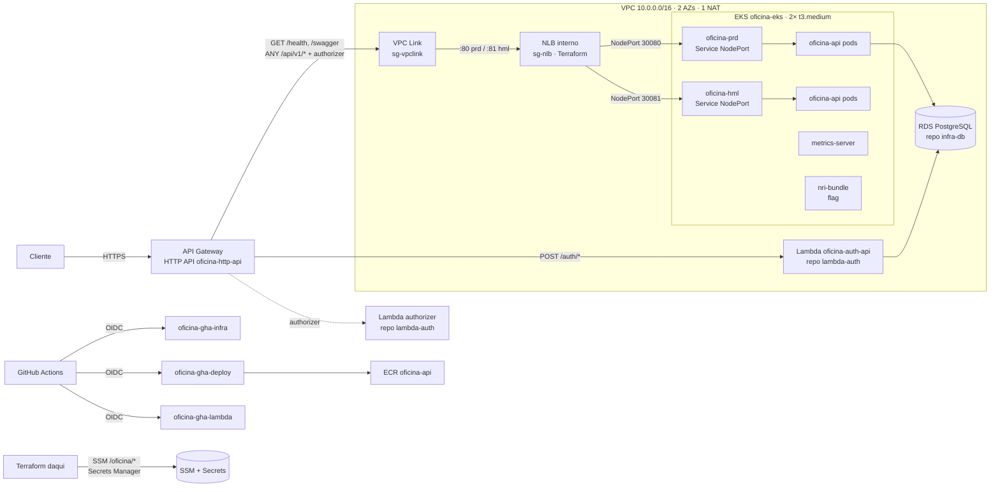

# Oficina Mecânica — Plataforma Kubernetes e borda HTTP (`oficina-infra-k8s`)

> **Tech Challenge — Fase 3 — Pós-Tech FIAP (15SOAT)**

Terraform da infraestrutura compartilhada da Fase 3: **VPC**, **EKS** (1 cluster, namespaces
`oficina-hml` e `oficina-prd`), **ECR**, **roles OIDC** do GitHub Actions, **NLB interno**
gerenciado pelo Terraform, **VPC Link**, **API Gateway HTTP API**, segredos compartilhados,
`metrics-server` e **New Relic** (Helm + dashboards/alertas como código, atrás de flag).

## Repositórios relacionados

| Repositório | Responsabilidade |
|---|---|
| [`oficina-app`](https://github.com/lcr-thiago-fernandes/oficina-app) | API .NET 8 em Kubernetes; documentação arquitetural central (`docs/`) |
| [`oficina-lambda-auth`](https://github.com/lcr-thiago-fernandes/oficina-lambda-auth) | Autenticação serverless (emissor único de JWT) e Lambda Authorizer |
| `oficina-infra-k8s` (este) | VPC, EKS, ECR, NLB interno, API Gateway, VPC Link, New Relic |
| `oficina-infra-db` | RDS PostgreSQL 16 |

Contratos: [`docs/contratos.md`](docs/contratos.md) e
[`oficina-app/docs/contratos-entre-repositorios.md`](https://github.com/lcr-thiago-fernandes/oficina-app/blob/develop/docs/contratos-entre-repositorios.md).

## Arquitetura



**Por que o Terraform é dono do NLB (ADR-016):** o VPC Link precisa do ARN do listener no
`apply`; um `Service LoadBalancer` só o teria depois do deploy da aplicação. Por isso o
Service do `oficina-app` é `NodePort` e o Terraform anexa o ASG do node group a um target
group por porta.

## Recursos

| Arquivo | O que cria |
|---|---|
| `terraform/vpc.tf` | VPC 2 AZs, subnets públicas/privadas, 1 NAT (por onde a auth-api sai para Secrets Manager e DynamoDB) |
| `terraform/eks.tf` | EKS `1.33`, node group `t3.medium` (2/1/3), addons, access entries para `gha-infra`, `gha-deploy` e `cluster_admin_principal_arns` |
| `terraform/ecr.tf` | `oficina-api`, scan on push, mantém 10 imagens |
| `terraform/iam-oidc.tf` | roles `oficina-gha-deploy` e `oficina-gha-lambda` (trust por branch, policies escopadas por nome) |
| `terraform/nlb.tf` | SGs `vpclink`/`nlb`, NLB interno, target groups 30080/30081 (`/health`), listeners 80/81, `aws_autoscaling_attachment` |
| `terraform/apigw.tf` | HTTP API, stage `$default` (access logs, teto global, throttling de `/auth/*` atrás de flag), VPC Link, integração HTTP_PROXY, 4 rotas sem authorizer |
| `terraform/secrets.tf` | `oficina/jwt_secret`, `oficina/newrelic_license_key` (texto puro) |
| `terraform/helm.tf` | `metrics-server` (HPA) e `nri-bundle` (flag `newrelic_habilitado`) |
| `terraform/ssm.tf` | os 8 parâmetros do contrato |
| `terraform/newrelic/` | root separado: política `Oficina-Prod`, 5 condições NRQL, dashboard, e-mail |
| `scripts/bootstrap.sh` | bucket + lock do tfstate, OIDC provider, role `oficina-gha-infra` |

## Ordem de provisionamento da Fase 3

```
1. scripts/bootstrap.sh          (local, uma vez)
2. oficina-infra-k8s  (este)     → publica SSM /oficina/network|apigw|eks|ecr, cria roles e segredos
3. oficina-infra-db              → RDS; /oficina/db/*; oficina/db_password
4. oficina-lambda-auth           → /auth/*, authorizer, ANY /api/v1/{proxy+}
5. oficina-app                   → imagem no ECR + kubectl apply (hml/prd)
6. (volta aqui) THROTTLING_AUTH_HABILITADO=true + re-executar o CD   ← decisão D1
```

`terraform destroy` na ordem inversa. Custo com tudo no ar: ~US$ 196/mês (EKS 73, nós 60,
NAT 32, RDS 15, NLB 16); destrua fora das janelas de demonstração.

## Bootstrap (uma vez)

```bash
export PATH="/c/Program Files/Amazon/AWSCLIV2:$PATH"   # Git Bash no Windows
aws configure   # credenciais de administrador da conta
./scripts/bootstrap.sh
```
O script imprime o ARN de `oficina-gha-infra`. Defina-o como secret `AWS_TERRAFORM_ROLE_ARN`
neste repositório e no `oficina-infra-db`.

## Deploy

| Branch | Ação do CD |
|---|---|
| `develop` | `terraform plan` |
| `main` | `terraform apply` (+ `terraform/newrelic` se `NEW_RELIC_HABILITADO=true`) |

Secrets do GitHub: `AWS_TERRAFORM_ROLE_ARN`, `JWT_SECRET` (≥ 32 chars), `NEW_RELIC_LICENSE_KEY`,
`NEW_RELIC_ACCOUNT_ID`, `NEW_RELIC_API_KEY`.
Variables: `AWS_REGION=us-east-1`, `NEW_RELIC_HABILITADO=false`, `THROTTLING_AUTH_HABILITADO=false`,
`NEW_RELIC_EMAIL_ALERTAS`.

Depois do `apply`, o job imprime `gha_deploy_role_arn` e `gha_lambda_role_arn`: eles viram
`AWS_DEPLOY_ROLE_ARN` no `oficina-app` e `AWS_LAMBDA_ROLE_ARN` no `oficina-lambda-auth`.

Manual, da máquina (a sua identidade precisa estar em `cluster_admin_principal_arns`):
```bash
export TF_VAR_jwt_secret='...32+ caracteres...'
terraform -chdir=terraform init
terraform -chdir=terraform apply -var-file=local.tfvars    # copie de exemplo.tfvars
aws eks update-kubeconfig --region us-east-1 --name oficina-eks
```

Homologação (`oficina-hml`, NodePort 30081) não passa pelo API Gateway: teste de dentro da
VPC (`kubectl -n oficina-hml port-forward svc/oficina-api 8081:80` ou `curl http://<nlb_dns_name>:81/health`
a partir de um pod).

## Observabilidade

- `metrics-server` sempre; `nri-bundle` (infra, kube-state-metrics, eventos, logs de sistema)
  quando `newrelic_habilitado = true`. O Fluent Bit **exclui** os namespaces `oficina-*`: os logs
  da aplicação já chegam pelo agente APM (logs in context), senão duplicam.
- `terraform/newrelic/`: `Oficina-API-Prod-Latencia-Critical`, `Oficina-API-Prod-TaxaErro-Critical`,
  `Oficina-API-Prod-Uptime-Critical`, `Oficina-OS-Prod-FalhaProcessamento-Critical`,
  `Oficina-EKS-Prod-CPU-Warning`; dashboard "Oficina Mecanica - Operacao" (6 widgets);
  notificação por e-mail. Runbooks em [`docs/runbooks.md`](docs/runbooks.md).

## Decisões e limitações registradas

1. **Throttling de `/auth/*` em duas passadas** (D1): `route_settings` exige rota existente; as
   rotas nascem no `lambda-auth`. Flag `throttling_auth_habilitado`.
2. **`oficina/newrelic_license_key` sempre existe** (D2), com placeholder quando desligado — o
   CD do `oficina-app` exige o segredo.
3. **hml só dentro da VPC** (D3): um único HTTP API, apontando para prd.
4. **NLB com SG próprio e `preserve_client_ip = false`** (D4): regras por referência de SG,
   health checks cobertos; IP do cliente em `X-Forwarded-For`.
5. **`GET /swagger` além de `/swagger/{proxy+}`** (D5).
6. **`oficina-gha-infra` com `AdministratorAccess`, criada fora do Terraform** (D6): o módulo
   EKS toca IAM, KMS, logs, launch templates; enumerar ações é frágil.
7. **`oficina-gha-lambda` mais ampla que o design, escopada por nome** (D7).
8. **Access entries determinísticas** (D8): quem aplica da máquina põe o próprio ARN em
   `cluster_admin_principal_arns`, senão o `helm_release` falha com `Unauthorized`.
9. **New Relic em root separado** (D9): o provider exige credenciais na configuração.
10. **Sem `plan` em PR** (D10): trust por branch não cobre `pull_request`.
11. **Providers em aws 5.x / eks 20.x / vpc 5.x / helm 2.x** (D11); Dependabot ignora majors.
12. **`use_lockfile` + `dynamodb_table`** no backend (D12); Terraform ≥ 1.10.
13. **`jwt_secret` no state** (D13): bucket criptografado, versionado, sem acesso público.
14. **Nada foi aplicado ainda**: `terraform validate` verde nos dois roots; o primeiro `apply`
    real pode revelar ajustes (versão do EKS disponível, nomes de inputs do módulo, schema do
    provider New Relic). Conferir `aws eks describe-cluster-versions` antes.

## Swagger

`GET https://<api_endpoint>/swagger` (produção) depois do deploy do `oficina-app`.

## Licença

Uso acadêmico — FIAP Pós-Tech 15SOAT.
